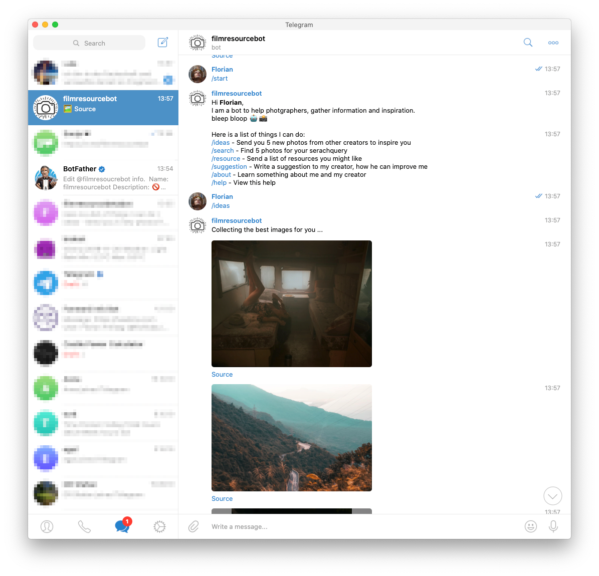

# Filmresourcebot
A simple bot to get ispiration & resources in the field of photography and film.
[Try it on Telegram](https://t.me/filmresoucrebot)

## Description
I wrote this bot for a friend, mainly to get inspiration for new fotos.

At the moment this bot is only available on 
[Telegram](https://t.me/filmresoucrebot). However, I plan on supporting more
plattforms in the future like Signal, or Discord.

## Build & Run yourself
You need to have pyhton3 installed on your system.
1. `pip3 install praw python-telegram-bot requests`
2. Rename `example-config.json` to `config.json` and enter your account settings.
3. `python3 main.py`

### Deployment
I deploy the bot on a raspberry pi, and so this repository has some specific 
files for that. Here are the steps I take to deploy the bot:
1. Create a folder on the pi `mkdir /home/pi/filmresourcebot`
2. Copy the files to the bot `scp ./* -r pi@192.168.8.164:/home/pi/filmresourcebot`
3. On the pi run `bash /home/pi/filmresourcebot/pi-deploy.sh`

## Contribute
Honestly, I am not a photographer, I just build this service for a friend. So if
you happen to have some resources I could add, just create a issue.