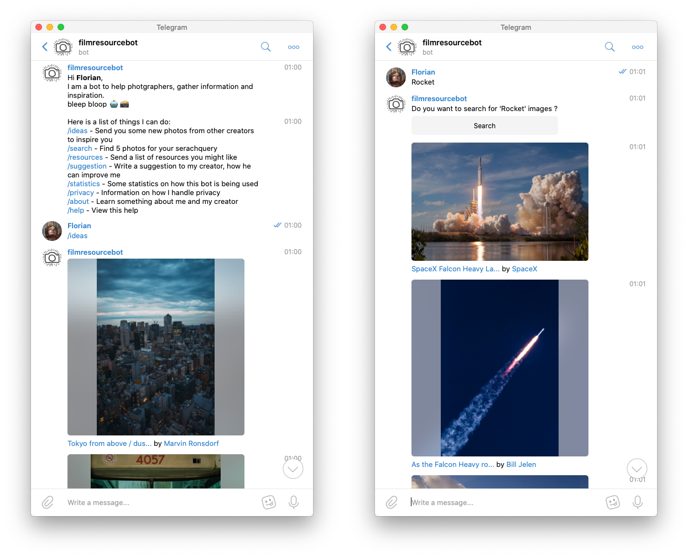

# Filmresourcebot
A simple bot to get ispiration & resources in the field of photography and film.
[Try it on Telegram](https://t.me/filmresoucrebot)


## Description
I wrote this bot for a friend, mainly to get inspiration for new fotos.

At the moment this bot is only available on 
[Telegram](https://t.me/filmresoucrebot). However, I plan on supporting more
plattforms in the future like Discord.

## Run the bot
You need to have pyhton3 installed on your system.
1. `pip3 install praw python-telegram-bot requests`
2. Rename `example-config.json` to `config.json` and enter your account settings.
3. `python3 main.py`

## Run the bot with Docker
Rename `example-config.json` to `config.json` and enter your account settings.
```
docker build -t filmresourcebot-template .
docker run --rm --name filmresourcebot-container filmresourcebot-template
```
Note: This way all will be lost once you shut down the bot. To prevent this you
can start the bot with a mounted docker volume.
```
docker volume create filmresourcebot-volume
docker build -t filmresourcebot-template .
docker run --rm --name filmresourcebot-container filmresourcebot-template
```

### Deployment
Look into `deploy.md` to see how I deploy the bot.

## Contribute
Honestly, I am not a photographer, I just build this service for a friend. So if
you happen to have some resources I could add, just create a issue.